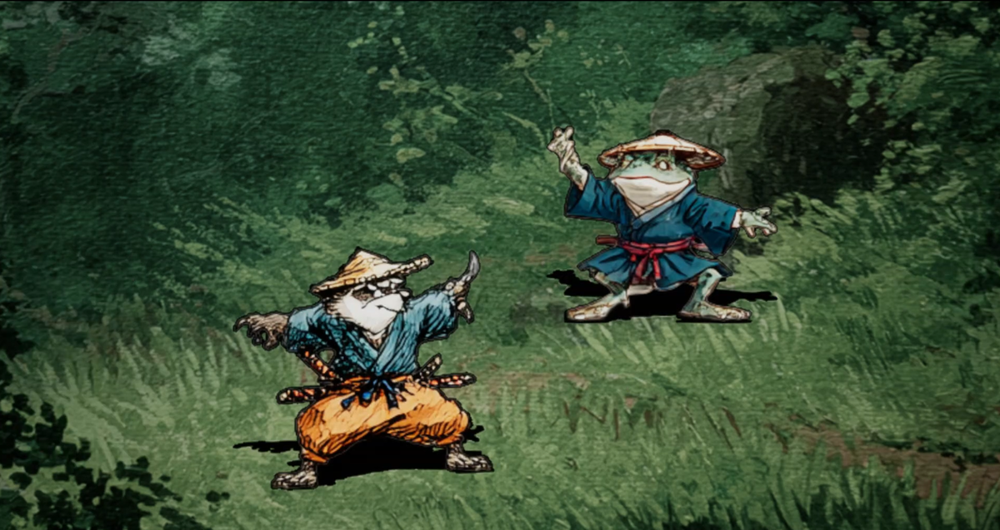
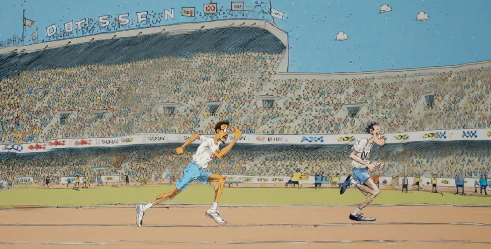
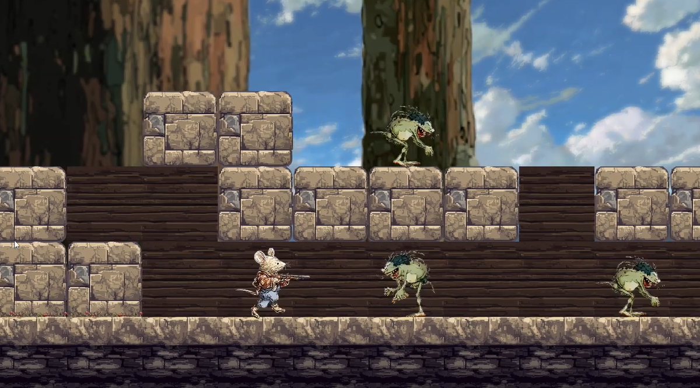
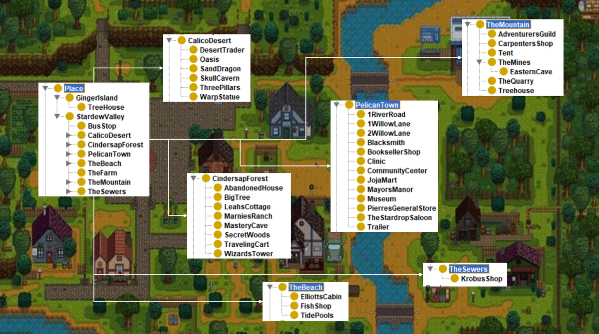
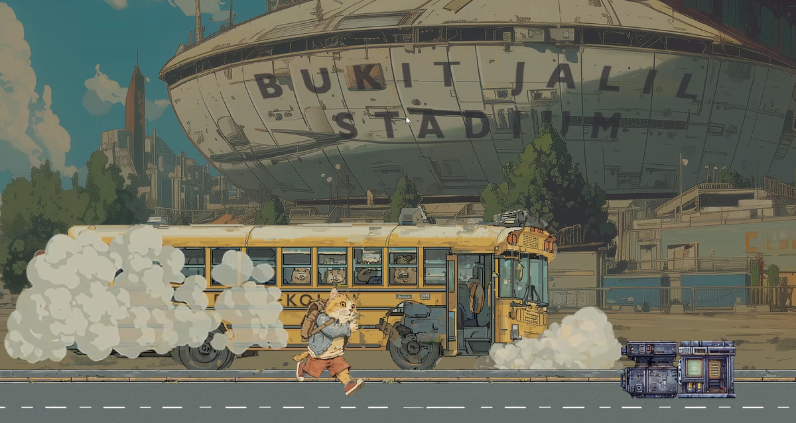

# A Comparative Study of AI Tools and Techniques for Assisting Solo Artists and Programmers in Developing Video Games from Scratch

The repository is a supporting resource for the study title "A Comparative Study of AI Tools and Techniques for Assisting Solo Artists and Programmers in Developing Video Games from Scratch".

Game assets are generated using AI tools and techniques. Techniques comprise evolution prompting where the images are generated with prompts tweaked and changed based on the result of previous batches. This is repeated until satisfactory results are obtained. Tweaks and updates are based on wording, style, 2D games, sprites, art mediums and more.

Generated images are further manipulated in Photoshop either to remove blemishes, improve production quality, or major updates like re-creating missing parts.

Videos are generated from which animation frames are created manually. Manual input is required for smooth and effective animations.

Game model and logic offloaded to AI systems has the potential to provide competitive advantage of faster development time and low maintenance in the long-term. Ontology based game modeling can be used to create highly complex game subsystems and interdependent entity logic and components with ease.

AI assistance used in building infrastrucutre support in the form of build files, compiler choices, installation, graphic library setup, editor configuration, language server installation, programming and debugging support.

The following games were created chronologically using AI in various steps of development. The end goal of using AI has been to create production-level games that solo developers can create despite limitations solo developers face in terms of resources, skills, development time, and budget.

## Samurai Toad
Created using Unreal Engine. The game does not have any animation but uses sequence of static poses that depict player and NPC idle, victory and defeat states.

Game demo video: https://youtu.be/Kyayyw2WItE

Package size: 293 MB
 
Not uploaded due to large file size.

## Catch Me
Created using Unreal Engine. AI generated animation is used in this games and the next two games: Rebel Mouse and Gubi Goes to APU.

Game demo video: https://youtu.be/PgfHuD0E4T8

Package size: 795 MB
 
Not uploaded due to large file size.

## Rebel Mouse
Created using C++ and SDL graphics library. As soon as manul C++ coding is used, the generated binaries get significant reduction in file size while gaining speed in performance. This example does not use a game engine. 

Game demo video: https://youtu.be/ggY7SbY24uQ

Package size: 24.5 MB
 
[Download zip: 18.8 MB](./packages/rebel_mouse.zip)
 
After unzipping, run game.bat

## Ontology Case Study of Stardew Valley
Created using ontologies based on RDF file format. [Protégé](https://protege.stanford.edu/) software is used for easily and visually creating ontologies. An example thin slice of the gifting subsystem of the game Stardew Valley was created as an example how such AI systems and models can be used for game development. 

Game demo video: https://youtu.be/r2MbA7n0r5I

[RDF file size: 272.4 KB](./packages/StardewValley.rdf)
 
After downloading, open the file in Protégé. 

## Final Prototype: Gubi Goes to APU
Created using C++ and SFML, and a custom game engine written from scratch. 

Game demo video: https://youtu.be/WsJ-LdBMv00

Package size: 76.2 MB
 
[Download zip: 43.7 MB](./packages/gubi_goes_to_apu.zip) 
 
After unzipping, run game.bat